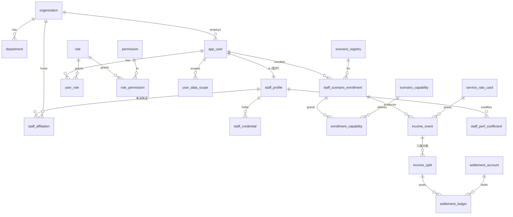
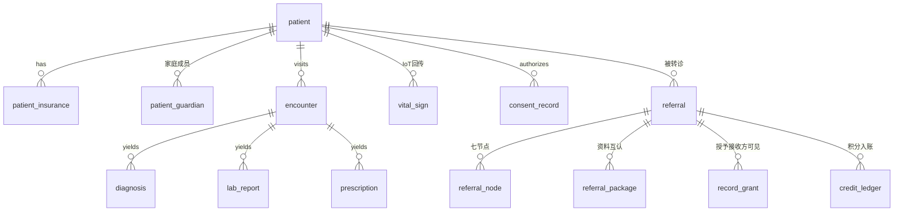

# 08 · 平台数据库设计（以 V10 演示为基准）

> 本文是 AI 云医院平台**数据模型的唯一基准**。所有场景建表前必须读本文，并遵守这里的
> Schema 划分、公共字段、权限模型与收入模型。基准来源：`ai-cloud-hospital-v10` 演示系统
> （温州AI云医院：患者端 / 医护端 / 监管端三端 + 转诊一件事 / 医生名片 / 家庭病床 / 个人健康
> 数据分析 4 个独立子系统，26+ 场景）。

---

## 0. 一句话总览

- 引擎 **PostgreSQL 14+**，**一库多 schema**（schema-per-domain）：平台共享域 `platform_*`、编号场景 `scenario_*`。
- **患者主数据只在 `platform_patient`**，场景库只存 `patient_id` 引用，绝不复制（合规红线，见根 `CLAUDE.md`）。
- 医护人员**属于各级医疗机构（三级/二级/一级/社区），不属于平台**；不同人参与不同场景 → **权限不同 → 收入不同**。
- 权限差异与收入差异**共用同一组维度**：`机构(org) × 科室(dept) × 职称(title) × 场景授权(enrollment) × 资质(credential)`。

---

## 1. 设计原则

| 维度 | 决策 | 理由 |
|---|---|---|
| 引擎 | PostgreSQL 14+ | schema 隔离、JSONB、行级安全(RLS)、`pgcrypto` 字段加密 |
| 隔离单位 | schema-per-domain（单实例多 schema） | 私有化单实例好运维；逻辑隔离又能跨域审计 |
| 主键 | UUID v7（时间有序） | 跨场景/机构不冲突，不暴露业务量 |
| 患者数据 | 仅 `platform_patient`，敏感字段加密落盘 | 合规红线 |
| 软删除 | 业务表统一 `is_deleted` | 医疗数据留痕，不物理删 |
| 财务/积分/审计 | append-only 台账，纠错走红冲 | 资金分配可审计 |
| 体征 IoT | 独立时序表，按月分区 | 高频写入，与业务表分离 |

---

## 2. Schema 总图

```
── 平台共享域（services/platform-*，多场景复用的真源）─────────────
platform_identity    机构/科室/用户/RBAC/数据权限/跨机构授权/场景授权
platform_patient     患者主数据 + 家庭成员 + 参保身份（敏感字段加密）
platform_archive     健康档案：就诊/诊断/检验/影像/心电/处方（跨院汇聚）
platform_iot         体征时序：血压/血糖/血氧/体重/睡眠（设备/护士/自报）
platform_consent     知情同意 / 数据授权（可撤回·全程留痕）
platform_file        文件对象元数据（报告 PDF / 影像 / 签署件）
platform_ai          AI 模型注册 + 调用记录（导诊/审方/外呼/月报/风险模型）
platform_clearing    阳光收入·空中清分台账（机构/科室/个人多方分账）+ 计价规则
platform_insurance   医保：参保/备案/报销规则/异常费用
platform_audit       全局审计（只追加）
platform_dict        数据字典（ICD / 互认目录 / 科室类型 / 枚举）

── 编号场景域（services/scenario-XXX-backend，工作流私有表）────────
scenario_referral    转诊一件事（单/七节点/五要素/资料包/积分链）
scenario_teleclinic  在线诊疗（候诊/接诊/处方/订单）
scenario_followup    诊后随访（计划/AI外呼/异常转人工）
scenario_doccard     医生名片（主页/粉丝/服务包/流量）
scenario_homebed     家庭病床（准入/医嘱/任务/质控）
scenario_mall        健康商城 + 服务包订单
scenario_research    GCP 招募 / RWS 真实世界研究
scenario_gov         监管驾驶舱（预警流/工单/专项规则库）
```

> 场景与平台的归属判定：**多场景复用的真源** → 平台域；**某条业务线的工作流** → 场景域。
> 场景域永远只存 `patient_id` 引用 + 业务工作流字段。

---

## 3. 公共字段规范（所有业务表必带）

统一为 py-common 的 `CommonColumns` Mixin（见 `packages/py-common/py_common/models.py`），全仓继承。

| 列 | 类型 | 说明 |
|---|---|---|
| `id` | uuid (v7) | 主键，时间有序 |
| `org_id` | varchar(32) | 数据归属机构（医共体多级），数据权限维度之一 |
| `dept_code` | varchar(32) | 归属科室（ASCII 代码，驱动数据权限，与 `auth.py` scopes 一致） |
| `created_at` / `updated_at` | timestamptz | 审计时间 |
| `created_by` / `updated_by` | varchar(64) | 操作人 user_id |
| `is_deleted` | bool | 软删除（默认 false，建索引） |
| `row_version` | int | 乐观锁 |

> `org_id` + `dept_code` 是整套权限的支点：V10 的"医共体协同 / 分账 / 转诊上下转"全靠这两维。
> HTTP 头只能 ASCII：`dept_code`/`scopes` 用科室代码（`card`/`endo`），含中文显示名由网关 URL-encode（见 `auth.py`）。

---

## 4. 权限模型

权限拆**两条正交轴 + 两层加成**，不要混在一起：

- **功能权限**（能不能点这个按钮/调这个接口）= RBAC：`user → role → permission`。
- **数据权限**（能看到哪些行）= scope：`org/dept` 范围 + 跨机构 `record_grant`。
- **场景授权**（能不能进这个场景、在里面能做什么）= `staff_scenario_enrollment + enrollment_capability`。
- **资质门槛**（够不够格做这个动作）= `staff_credential + title_rank`。

### 4.1 机构是分级的（医共体）

```sql
organization(
  org_id PK, name,
  tier         varchar,   -- 三级 / 二级 / 一级 / 社区
  group_id     varchar,   -- 所属医共体
  parent_id    varchar    -- 上级机构
)
department(
  dept_code PK, name, org_id FK, parent_code, type
)
```

`tier` 直接影响：转诊上下方向、医保报销比例、计价档位、质量系数。

### 4.2 用户与 RBAC

```sql
app_user(
  user_id PK, username, name, password_hash,
  source     varchar,   -- his / ldap / local
  user_type  varchar,   -- resident(居民) / staff(医护) / regulator(监管) / admin(管理)
  org_id, primary_dept_code, status
)
role(role_code PK, name, builtin, description)
permission(perm_code PK, name, type, resource)   -- type: menu/action/api
user_role(user_id, role_code)
role_permission(role_code, perm_code)
```

四类主体的数据权限解析规则不同：

| 端 | user_type / 角色 | 数据权限解析 |
|---|---|---|
| 患者端 C | resident / family_guardian | 本人 + 被授权家属（`patient_id ∈ 本人 + 监护关系`） |
| 医护端 H | doctor / nurse | 本科室 + 被分配患者 + 跨机构转诊授权（`record_grant`） |
| 监管端 G | regulator | 全市只读 + 工单处置，**默认脱敏**，下钻需二次授权留痕 |
| 管理 B | org_admin / platform_admin | 本机构 / 全平台配置 |

### 4.3 数据权限：scope + 跨机构授权

```sql
user_data_scope(
  user_id, scope_type, org_id, dept_code
)   -- scope_type: all / org / dept / dept_and_sub / self / custom

patient_guardian(
  patient_id, guardian_user_id, relation, authorized_scope
)   -- 家庭成员：母亲家庭病床、女儿成长图谱

record_grant(
  resource_type, resource_id,
  grantee_org, grantee_dept,
  grant_reason,   -- referral / mdt / consult
  expire_at
)
```

`scope_type` 解析为具体科室/机构集合（platform-auth 登录时展开 → 写入令牌 → 网关注入头）：

| scope_type | 含义 | 解析为 |
|---|---|---|
| `all` | 全平台 | 平台管理员 |
| `org` | 本机构 | 该 org 全部 dept_code |
| `dept` | 本科室 | `primary_dept_code` |
| `dept_and_sub` | 本科室及下级 | 按 `department.parent_code` 递归 |
| `self` | 仅本人经手 | 查询加 `created_by = user_id` |
| `custom` | 自定义授权 | `user_data_scope` 列出的 dept_code |

**跨机构可见性（V10 最难点）**：一张转诊单同时属于转出机构和接收机构，`dept_code IN scopes` 看不全。
查询统一封装为 `WHERE dept_code IN (scopes) OR EXISTS(record_grant 命中)`。转诊提交即给接收方写一条 grant，
知情同意/资料互认就有了权限边界，也避免患者数据在机构间冗余复制。

### 4.4 场景级授权（不同人参与不同场景，权限不同）

```sql
scenario_registry(scenario_code PK, name, owner_dept, status)   -- = 场景登记表落库
scenario_capability(scenario_code, cap_code, name)              -- 场景内细粒度能力点

staff_scenario_enrollment(
  enrollment_id PK, user_id, scenario_code, scenario_role, status, enrolled_at
)
enrollment_capability(enrollment_id, cap_code, granted)
```

**有效权限 = 五者求交**（封装进 py-common `require_cap()`，场景不准自己拍）：

```
allow = RBAC功能权限
      ∩ 场景已授权(enrollment.status=active)
      ∩ 场景能力点(enrollment_capability)
      ∩ 资质满足(staff_credential 有效 + title_rank 达标 + 多点执业备案)
      ∩ 数据权限(org/dept scope + record_grant)
```

V10 三个真人示意（同是"医护"，权限天差地别）：

| 人 / 机构 | 场景授权 | 关键能力点(cap) | 资质门槛 |
|---|---|---|---|
| 王明远 主任·心内·三级 | teleclinic / referral / doccard / mdt / research | `prescribe` 开处方、`sign_report` 签发报告、`referral.receive` 接收上转、`sell_package` 上架服务包、`research.pi` 担任 PI | 执业医师证 + 多点执业备案 + CA 签名 |
| 李明 家庭医生·社区 | referral / followup | `referral.initiate` 发起上转、`followup.execute` 随访执行、`referral.downward.accept` 下转接续 | 执业医师证（无接收上转权） |
| 护士 / 护理员 | homebed / homecare | `care_task.execute` 上门/查房、`vital.entry` 体征录入 | 护士执业证（无处方/签报告权） |

---

## 5. 跨机构身份与差异化收入模型

医护"机构归属 + 职称 + 资质"决定他**能不能参与**某场景、**按什么档计酬**。拆成四组解耦的表。

### 5.1 跨机构身份与资质

```sql
staff_profile(
  user_id PK, name,
  home_org_id,        -- 主执业机构
  primary_dept_code,
  title       varchar,   -- 主任/副主任/主治/住院医/护师/护理员
  title_rank  int,       -- 用于计价分档与资质门槛比较
  practice_score numeric, -- 执业评分（V10: 4.97）
  accept_external bool    -- 院外接单开关
)
staff_affiliation(           -- 一个医护多机构执业 → 多对多
  user_id, org_id, affil_type, dept_code, status
)   -- affil_type: 主执业 / 多点执业备案
staff_credential(
  user_id, type, cert_no, scope, valid_until, status
)   -- type: 执业医师证 / 护士执业证 / 多点执业备案 / 电子签名CA；过期自动失效（gating）
```

### 5.2 差异化计价 → 多方分账 → 个人账户

```sql
service_rate_card(
  id PK, scenario_code, service_type,
  applies_org_tier,    -- 三级/二级/一级/any
  applies_title_rank,  -- >=主治 / any
  unit_price,
  individual_ratio, dept_ratio, org_ratio, platform_ratio,
  floor_price, cap_price,           -- 转诊积分单价保底/封顶
  effective_from, effective_to, status
)
income_event(
  event_id PK, scenario_code, service_type,
  performer_user_id, perform_org_id,   -- 当次执业机构（收入回流依据）
  engagement_mode,                     -- in_hospital 院内 / multi_site 院外（决定分账档）
  patient_id, gross_amount, occurred_at, clearing_status
)
income_split(
  event_id, payee_type, payee_id, ratio, amount
)   -- payee_type: org / dept / individual；append-only
staff_perf_coefficient(
  user_id, period, volume_coef, quality_coef, response_coef, rating_coef
)   -- V10「按服务量·质量·响应·评价计酬」→ 个人到账乘数
settlement_account(account_id PK, owner_type, owner_id, balance)
settlement_ledger(account_id, event_id, amount, occurred_at, clearing_ref)
```

**个人到账公式**：

```
个人金额 = unit_price × individual_ratio × 综合绩效系数,  夹在 [floor_price, cap_price]
综合绩效系数 = volume_coef × quality_coef × response_coef × rating_coef
```

**差异化算例**（同样的服务，不同的人拿不同的钱）：

| 事件 | 命中档位 | 分账(院外多点) | 个人到账 |
|---|---|---|---|
| 报告解读×1（王明远·三级·主任） | rate ¥15, title≥主治 | 个人 70% | 15×0.70×1.02 ≈ **¥10.7** |
| MDT 会诊（王明远·三级·主持） | 三级专家档 ¥200 | 个人 60% / 科室 20% / 机构 20% | 200×0.60 ≈ **¥120** |
| 转诊上转节点（李明·社区·家庭医生） | 转诊积分 → 单价(保底1.5/封顶3.5) | 入个人信用账户（不按月清零） | 积分×三源单价 → `credit_ledger` |

### 5.3 因果链（权限与收入同源）

```
staff_affiliation(在哪家机构执业)
  └→ staff_scenario_enrollment(被授权进哪个场景、什么角色)
       └→ enrollment_capability + staff_credential(能做哪些动作)
            └→ 产生 income_event(标 perform_org + 院内/院外)
                 └→ service_rate_card 按【tier+职称】定价
                      └→ income_split 三级分账 × perf_coefficient
                           └→ settlement_ledger 到个人账户（空中清分留痕）
```

> 一个医生在某场景没被授权，就**既看不到数据、也不会产生该场景的收入事件**，权限与收入天然自洽。

---

## 6. 平台共享域核心表（对应 V10 画面）

### platform_patient（敏感字段 `pgcrypto` 加密，读时按角色脱敏）

```sql
patient(patient_id PK, mrn, name_enc, id_card_enc, id_card_hash, phone_enc,
        gender, birth_date, org_id, health_score, risk_level)
patient_insurance(patient_id, insurance_type, pooling_region, annual_reimbursed, cap_line)
patient_guardian(... 见 4.3 ...)
```

### platform_archive（"档案贯通 12 家机构 · 47 次就诊 · 128 份报告"）

```sql
encounter(encounter_id PK, patient_id, org_id, dept_code, type, visit_time, doctor_id)
diagnosis(patient_id, encounter_id, icd_code, name, is_chronic)
lab_report / imaging_report / ecg_report(
  report_id PK, patient_id, encounter_id, conclusion, file_id,
  mutual_recognition, valid_until, recognize_scope)   -- 检查互认目录
prescription(rx_id PK, encounter_id, status, ai_review_result)
prescription_item(rx_id, drug_code, usage, course)
```

### platform_iot（体征时序，高频 → 按 `measured_at` 月分区 / TimescaleDB）

```sql
vital_sign(
  patient_id, metric, value JSONB, measured_at,
  source,      -- device / nurse / self
  device_id, abnormal_flag, org_id, dept_code)
```

### platform_consent（V10 反复出现的"已授权/已撤回·操作已留痕"）

```sql
consent_record(
  patient_id, grantee, purpose, scope,
  status,      -- granted / revoked
  granted_at, revoked_at, evidence_file_id, signed_hash)
```

### platform_ai（每次 AI 调用留痕，CLAUDE.md 红线"禁喂敏感数据"）

```sql
ai_model(model_id PK, name, type, version, endpoint)   -- type: llm/cv/asr/risk
ai_task(task_id PK, scenario, model_id, user_id, patient_id, purpose,
        input_ref, output_ref, tokens, latency_ms, human_reviewed_by)
```

`input_ref / output_ref` 只存引用或**脱敏后**文本。AI 生成必经医师复核（`human_reviewed_by`）。

### platform_insurance

```sql
insurance_policy_rule(referral_type, insurance_type, deductible, reimburse_ratio, cap_line)
fee_abnormal_case(patient_id, org_id, fee, reason, review_conclusion)
```

---

## 7. 编号场景域核心表

### scenario_referral（转诊一件事，V10 最完整子系统）

```sql
referral(ref_no PK, patient_id, source_org, source_doctor, target_org, target_doctor,
         type, risk_level, status, appointment_slot)   -- type: 上转/下转/平转/急诊/MDT
referral_node(ref_no, node, done_at, operator)         -- 七节点积分链
referral_check(ref_no, item, passed)                   -- 规范转诊五要素
referral_package(ref_no, doc_type, source_report_id, mutual_recognition)  -- 资料互认包
credit_account(user_id PK, balance)                    -- 个人服务信用账户（不按月清零）
credit_ledger(user_id, ref_no, node, points, drg_amt, perf_amt, surplus_amt)  -- 三源
org_settlement(org_id, period, service_amount, quality_bonus, actual_alloc)   -- 机构分账
```

### 其余场景（结构同构，列要点）

- `scenario_teleclinic`：`consult`(候诊/图文视频/AI预问诊) → `prescription`(走 platform_archive) → `order`。
- `scenario_followup`：`followup_plan` / `followup_task`(AI外呼) / `followup_result`(异常转人工)。
- `scenario_doccard`：`doctor_card` / `card_follower` / `service_package` / `card_visit_stat` / `consult_thread`。
- `scenario_homebed`：`bed_admission`(6步准入) / `medical_order` / `care_task`(看板) / `bed_alert` / `bed_fee` / `quality_control`；体征读 `platform_iot`。
- `scenario_mall`：`product` / `order` / `payment`（清分入 `platform_clearing`）。
- `scenario_research`：`trial`(GCP) / `trial_candidate`(脱敏初筛·医师署名邀请) / `rws_cohort` / `rws_outcome`。
- `scenario_gov`：`alert_feed`(规则引擎+AI异常) / `alert_ticket`(证据链/处置闭环) / `supervision_rule`(五大专项规则库)；监管端读全平台脱敏视图，不自存业务数据。

---

## 8. ER 关系图

### 8.1 身份 · 机构 · 权限 · 收入（核心骨架）



### 8.2 患者 · 档案 · 授权 · 跨机构（数据可见性）



---

## 9. 落地约定

- **命名**：schema `platform_*` / `scenario_*`；表 snake_case 单数；场景表带场景含义前缀避免跨库混淆。
- **加密**：`name/id_card/phone` 等 `*_enc` 用 `pgcrypto` 对称加密；密钥运行时注入，不进仓库/镜像。
  另存 `id_card_hash`（不可逆）用于查重/匹配。
- **脱敏**：读取按角色调用 py-common 的 `mask_*`（见 `desensitize.py`）。
- **审计**：患者数据增删改查必须 `audit_action`（见 `audit.py`），落 `platform_audit`（只追加）。
- **数据权限**：场景查询统一走 py-common `scope_filter()`，不准裸写 `WHERE dept_code`。
- **场景能力校验**：接口用 `require_cap("prescribe")`（见 `auth.py` 的 `require_roles` 同款工厂）。
- **迁移**：每个 schema 独立 Alembic 版本目录；平台域先行，场景域依赖平台域枚举/字典。
- **与 py-common 对应**：`CommonColumns`(models.py) / `scope_filter`·`record-grant`(authz.py) /
  `require_cap`(auth.py) / `split_income`(clearing.py)。

---

## 10. 实施顺序建议

1. `platform_identity`（机构/科室/用户/RBAC/数据权限/场景授权/staff_*）——一切的基座。
2. `platform_clearing`（rate_card / income_event / income_split / settlement）——差异化收入。
3. `scenario_referral`——V10 最完整链路，作为第一个端到端样例（含跨机构 `record_grant`）。
4. 其余平台域（patient/archive/iot/consent/ai/insurance）与场景域按场景登记表排期推进。

> 详见配套：`packages/py-common/py_common/{models,authz,clearing}.py` 与
> `infra/db/migrations/`（平台域 DDL + Alembic 初版）。
